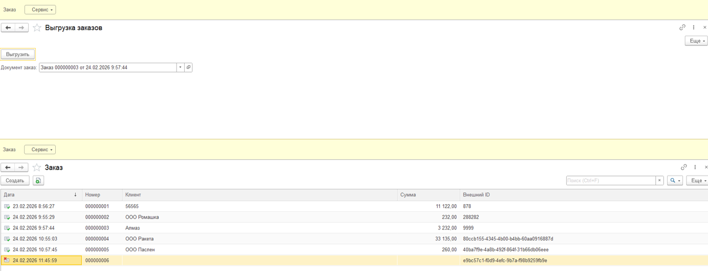
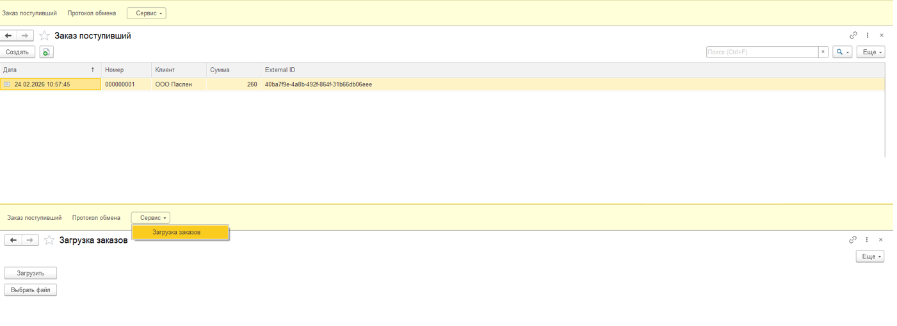

# Обмен заказами между конфигурациями 1С

## Описание проекта

Проект представляет собой реализацию механизма обмена данными между двумя конфигурациями на платформе 1С:Предприятие 8.3.

В рамках проекта реализованы:

* Создание и регистрация документа заказа
* Выгрузка документа в XML-файл
* Загрузка XML-файла в другую конфигурацию
* Заполнение табличной части документа
* Передача даты и времени заказа

# Структура проекта

Проект состоит из двух конфигураций.

## Конфигурация 1 (Центральная). Формирование и выгрузка заказа

Назначение конфигурации — создание документа заказа и его выгрузка в XML для передачи во вторую базу.

### Реализовано

Документ «Заказ», содержащий:

* Дата (с учетом времени)
* Номер
* Контрагент
* Табличная часть «Товары»:

  * Номенклатура
  * Количество
  * Цена
  * Сумма

Дополнительно реализовано:

* Формирование XML-файла установленной структуры
* Контроль редактирования зарегистрированных документов
* Передача внешнего идентификатора (ExternalID)

### Скриншоты конфигурации 

[](Центральная/ЦентральнаяБаза.png)

---

## Конфигурация 2 (Торговля). Загрузка заказов из XML

Назначение конфигурации — импорт XML-файла и создание на его основании документа заказа.

### Реализовано

* Обработка «ЗагрузкаЗаказов»
* Чтение XML через DOM
* Создание нового документа
* Заполнение реквизитов документа
* Заполнение табличной части
* Корректная обработка даты и времени
* Проверка существования элементов справочников (например, номенклатуры)

### Скриншоты конфигурации 

[](Торговля/Торговля.png)


# Структура XML-файла

Пример передаваемого файла:

```xml
<Order>
    <ExternalID>123</ExternalID>
    <Date>2026-02-18T14:35:12</Date>
    <Customer>ООО Ромашка</Customer>
    <Items>
        <Item>
            <Name>Монитор</Name>
            <Quantity>2</Quantity>
            <Price>15000</Price>
        </Item>
    </Items>
</Order>
```

Передаются следующие данные:

* Внешний идентификатор документа
* Дата и время
* Контрагент
* Состав табличной части (номенклатура, количество, цена)

# Контроль редактирования документов

Реализована логика запрета редактирования зарегистрированных документов.

Если документ зарегистрирован и пользователь не обладает соответствующими правами, изменение документа запрещается. Рекомендуемый механизм реализации — через роли, а не через проверку имени пользователя.

# Используемые технологии

* 1С:Предприятие 8.3
* XML (DOM)
* Регистр сведений
* Общие модули


